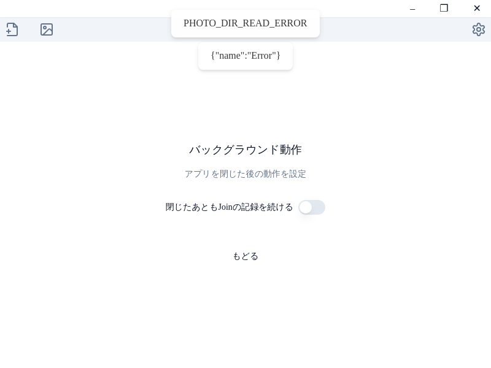

# vrchat-join-recorder

## 機能
* 過去に訪れたワールドの名前を確認する、そこで撮られた写真を確認する
  * 
* GooglePhoto 等と共に使用することで、訪れたワールドの記録をクラウドサービス上で確認、検索できるようにする
  * 

## 確認済み動作環境
* Windows 11

## インストール方法
### 1. リリースページから最新のリリースをダウンロード
* https://github.com/tktcorporation/vrchat-join-recorder/releases を開く
* app-windows-latest-vx.x.x.zip をダウンロード

### 2. .exe ファイルを実行
* ダウンロードした zip ファイルを解凍
* **vrchat-join-recorder Setup x.x.x.exe** を実行

## 使い方
* VRChat 上でワールド移動や写真の撮影を行う
* **vrchat-join-recorder** を起動
* New 画面で **保存する** を実行すると、Join したワールドの情報が保存される
  * 
  * **保存する** では、Join記録を VRChat で撮影した写真が保存される場所と同じ場所に画像ファイルとして保存する
  * 保存する を行わなった場合、古いJoin記録は一定期間で取得できなくなる

### オプション
* 設定 > バックグラウンド設定 から
  * 
  * 保存する を手動で実行しなくても、Join したワールドの情報を自動で保存するように設定できる

### 活用例
* 過去に訪れたワールドの名前を確認する、そこで撮られた写真を確認する
  * 保存した情報は、いつでもアプリ内、もしくは写真フォルダ内で確認できるため、過去の記録を振り返る
  * あの日に行ったワールドってどこだっけ？この写真を撮ったのってどこだっけ？を解決する
* GooglePhoto 等と共に使用することで、訪れたワールドの記録をクラウドサービス上で確認、検索できるようにする
  * VRChat の写真フォルダを GooglePhoto 等に同期することで、VRChat で撮影した写真をクラウドサービス上で閲覧できるが、この App と併用することで、訪れたワールドの情報もクラウドサービス上で確認できる
    * GooglePhoto であれば、ワールド名で検索することで、そのワールドに訪れた記録を一括で検索できるようになる
  * 

## 開発者向け情報
* see [DEV_README.md](DEV_README.md)
